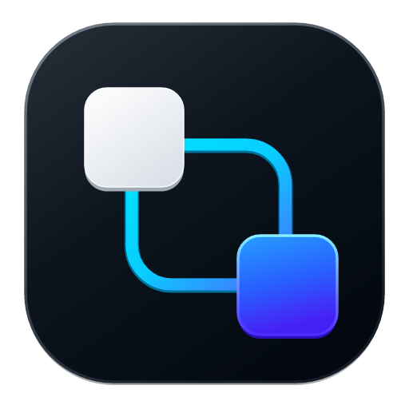
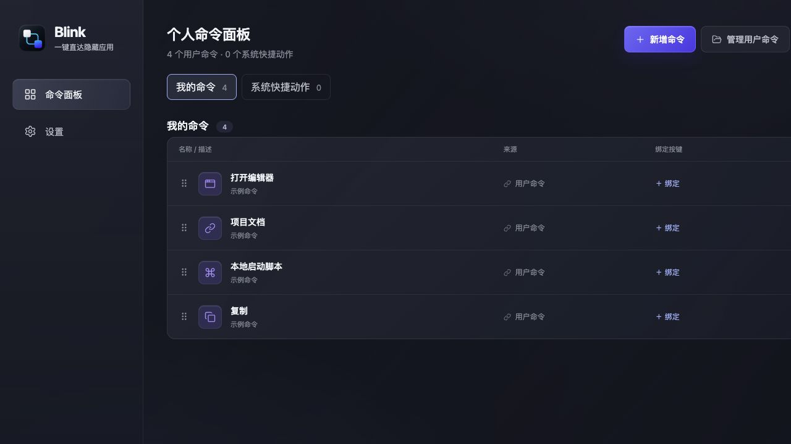

<p align="center">
  
</p>

<h1 align="center">Blink</h1>

<p align="center"><strong>把常用动作，交给一个按键。</strong></p>

<p align="center">
  打开应用、直达文件，或运行自己的脚本。<br />
  在 Blink 中创建命令，绑定按键，在其他应用中也能触发。
</p>

<p align="center">
  <a href="https://blink.learnaiwithcode.com/">官网</a> ·
  <a href="https://github.com/codeinsightlab/Blink-Releases/releases/latest">下载 Blink</a> ·
  <a href="https://blink.learnaiwithcode.com/changelog">更新日志</a> ·
  <a href="#本地开发">本地开发</a>
</p>

<p align="center"><sub>macOS · Windows · 公开测试中</sub></p>

<p align="center">
  
</p>

## 留一个按键，给经常重复的事

把项目文件夹放在手边，把常用工具叫到前台，把每天都要执行的操作保存为命令。Blink 支持普通键盘快捷键，也支持外接键盘发出的可识别按键。

| 想做的事                     | 在 Blink 中配置                              |
| ---------------------------- | -------------------------------------------- |
| 叫出常用应用，再按一次收起   | 打开应用，并启用快速切换；收起行为依平台而异 |
| 用顺手的按键触发已有快捷操作 | 发送快捷键                                   |
| 直达项目文档或工作网站       | 打开网址                                     |
| 打开每天都要找的资料         | 打开文件或文件夹                             |
| 执行自己的重复任务           | 运行本地脚本                                 |

不需要额外购买硬件。先选一个经常发生的操作，为它绑定一个自己记得住的按键。

## 开始使用

从 [最新 Release](https://github.com/codeinsightlab/Blink-Releases/releases/latest) 下载适合系统的安装包。

| 系统                  | 安装包           |
| --------------------- | ---------------- |
| macOS · Apple Silicon | `.dmg`           |
| Windows · x64         | `.exe` 或 `.msi` |

1. **创建命令** — 打开 Blink，点击「新增命令」，选择动作并设置目标。
2. **绑定按键** — 为命令录入按键或组合键，保存绑定。
3. **实际触发** — 切换到其他应用，按下绑定的按键，确认执行结果。

也可以导入已有的 Profile 配置，再绑定本机按键。Web Studio 提供另一条配置路径：编排并导出 Profile，在桌面端导入执行。

> **当前为早期测试版本。** 不同应用、多窗口和系统环境仍可能存在兼容性差异。macOS 安装包尚未完成 Developer ID 签名与 Apple 公证，安装前请阅读下方说明。

<details>
<summary><strong>macOS 安装、权限与升级</strong></summary>

将 `Blink.app` 拖入「应用程序」，从 `/Applications` 启动。如果系统阻止打开，请先阅读安装包内的说明，或查看仓库中的 [macOS 安装说明](runtime/macos/README%20-%20macOS.txt)。仅从官网或官方 Release 下载。

发送快捷键和部分应用控制能力需要辅助功能权限：

1. 按提示打开「系统设置 → 隐私与安全性 → 辅助功能」。
2. 添加并开启当前 `/Applications/Blink.app`。
3. 回到 Blink，切换到目标应用，实际验证一次触发结果。

当前测试包升级后可能需要重新授权。若出现权限提示，请完全退出 Blink，在辅助功能列表中移除旧条目，重新添加当前应用，再启动验证。

</details>

<details>
<summary><strong>使用脚本与快捷键前</strong></summary>

- 只运行自己理解并信任的脚本；输入校验与超时控制不能替代对脚本内容的判断。
- 发送快捷键时，请确认当前前台应用是预期接收者。
- 绑定时注意系统或其他应用已占用的快捷键，并用真实目标验证结果。

</details>

## 本地开发

本仓库包含桌面客户端、Web Studio、官网与共享数据契约。开发分支可能包含尚未发布的功能；下载体验请以公开 Release 为准。

| 目录                                                   | 内容                             | 技术                            |
| ------------------------------------------------------ | -------------------------------- | ------------------------------- |
| [`runtime/`](runtime/)                                 | 桌面客户端、按键绑定与动作执行   | Tauri 2 · Rust · TypeScript     |
| [`src/`](src/)                                         | Web Studio，配置与导出 Profile   | React · TypeScript · Vite       |
| [`packages/blink-contract/`](packages/blink-contract/) | Profile 类型、校验规则与生成方法 | TypeScript · Zod                |
| [`website/`](website/)                                 | 官方网站与更新日志               | React · Vite · Cloudflare Pages |
| [`tests/`](tests/)                                     | 模型、配置生成与跨语言一致性测试 | TypeScript · Rust               |

**环境：** Node.js 22.12+ 与 npm；桌面开发另需 Rust stable 和 Tauri 平台构建依赖。macOS 使用 Xcode Command Line Tools，Windows 使用 Microsoft C++ Build Tools 与 WebView2。完整要求见 [Tauri 官方文档](https://v2.tauri.app/start/prerequisites/)。

```bash
# 安装根项目与共享契约依赖
npm install

# 安装桌面端依赖并启动
npm --prefix runtime install
npm --prefix runtime run tauri:dev
```

<details>
<summary><strong>Web Studio 与官网开发</strong></summary>

在仓库根目录分别执行：

```bash
# Web Studio
npm run dev

# 官网
npm --prefix website install
npm --prefix website run dev
```

</details>

<details>
<summary><strong>构建与检查</strong></summary>

以下命令均从仓库根目录执行：

```bash
# Web Studio：类型检查与构建
npm run typecheck
npm run build

# 桌面端：仅构建前端资源
npm --prefix runtime run build

# 桌面端：构建原生应用及安装包
npm --prefix runtime run tauri -- build

# 官网：安装依赖后执行
npm --prefix website run typecheck
npm --prefix website run build

# 模型、跨语言契约、命令创建与存储测试
npm run test:models
npm run test:parity
npm run test:creator
npm run test:storage

# 格式检查
npm run format:check
```

本地构建不等于公开发行；签名、公证和发布资产需按发行流程单独验证。

</details>

<details>
<summary><strong>架构与配置约定</strong></summary>

- **Profile 描述动作，Binding 保存本机触发关系。** 桌面端可以直接创建命令，也可以接收 Web Studio 导出的 Profile。
- **共享契约明确数据边界。** `@blink/contract` 提供 TypeScript 类型、Zod Schema 与生成方法；Rust 端通过一致性测试核对解析与往返结果。
- **平台各自实现原生行为。** Blink 统一能力和结果语义，macOS 与 Windows 分别处理输入、窗口、权限与执行。
- **开发约束见 [AGENTS.md](AGENTS.md)。** 部分 `docs/` 资料仅保存在本地，不保证随仓库分发。

</details>

## 反馈

反馈时请附上 Blink 版本、操作系统、目标应用、复现步骤，以及「期望发生什么 / 实际发生什么」。提交日志或截图前，请移除私人路径、脚本内容与敏感信息。

## 许可

本仓库目前未声明开源许可证。
